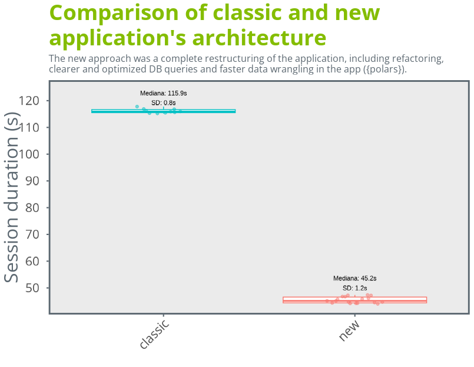
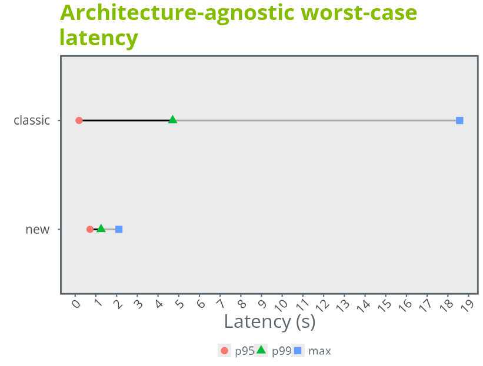

# Redesigning an Application in Production: _Instalometro na Conectividade na Saúde_

## Overview
**Instalometro na Conectividade na Saúde** was an established application for exploring and monitoring internet connectivity among health institutions in Brazil. As data volume, users, and delivery expectations grew, the original setup began to show limits: slow startup times, heavy payloads, fragile builds, and unclear performance characteristics.

This case study documents how I and [Cristiane Milan](https://br.linkedin.com/in/cristiane-millan) took the app from *it works* to *production-ready*, focusing on **data architecture, performance, and reproducibility** rather than just features.

---

## Context & Constraints

- Increasing dataset sizes (hundreds of thousands of rows)
- Multi-user Shiny deployment
- PostgreSQL/PostGIS as the authoritative data source
- CI/CD with containerized deployment
- Need for deterministic builds and clean handover

The goal was not to over-engineer, but to **remove the biggest bottlenecks first**.

---

## Decision 1 — Stop Serving Large Datasets as JSON

### Problem

Early versions of the app and supporting APIs relied on JSON for data exchange. This quickly became a bottleneck:

- large payloads
- expensive parsing
- high end-to-end latency

### Solution

For bulk data access, we replaced JSON responses with **Parquet** exports:

- columnar, binary format
- significantly smaller payloads
- much faster client-side loading using Arrow / Polars

This change alone reduced transfer size by an order of magnitude and cut perceived latency dramatically.

**Key lesson:** JSON is convenient, but at scale it becomes a tax you pay on every request.

---

## Decision 2 — Push Reduction Down, Pull Parquet for Iteration

### Problem

A recurring question was where to execute data operations:

- in PostgreSQL/PostGIS
- or inside R after extraction

### Working model

- **Do expensive reduction early** (filters, joins, spatial operations) in the database
- **parameterized API endpoints** to avoid full exports
- **Export reduced results** as parquet
- Use **`{polars}`** locally for iteration-heavy transformations

This avoided repeated DB round-trips while still leveraging indexes and PostGIS where they matter most.

**Key lesson:** databases are excellent at reduction; local engines shine at iteration.

---

## Decision 3 — Scaling Shiny with `{polars}` and Lazy Loading

### Problem

Loading full tables eagerly at app startup caused:
- slow startup times
- unnecessary memory usage
- poor scalability under concurrent users

### Solution

We refactored the server logic to:
- separate **data access** from **reactive logic**
- rely on **Parquet-backed datasets**
- use **`{polars}` with lazy evaluation**

Data is now loaded only when needed, and only the required columns are materialized.

### Outcome

- faster startup
- lower memory pressure
- more predictable performance under load

**Key lesson:** Shiny performance improves dramatically when treated as a *consumer* of data pipelines, not their executor.

---

## Decision 4 — Deterministic Builds with `{renv}` and Multi-Stage Docker

### Problem

Restoring R packages at runtime caused:

- slow container startup
- fragile network-dependent behavior
- inconsistent environments

### Solution

We adopted a **multi-stage Docker build**:
- restore `{renv}` dependencies once in a builder stage
- copy the resulting library into a minimal runtime image
- explicitly configure `R_LIBS_SITE` so R can find the correct library

This made the runtime image:
- smaller
- deterministic
- independent of `renv::restore()` at startup

**Key lesson:** reproducibility belongs in the build phase, not at runtime.

---

## Decision 5 — Faster CI/CD with Docker Buildx

### Problem

Classic Docker builds in CI were slow and cache-unfriendly, especially with compiled R packages.

### Solution

We migrated to **Docker Buildx with registry-backed cache**:
- shared cache across CI jobs and runners
- clean handling of private dependencies via BuildKit secrets
- build + tag + push as a single atomic step

### Outcome

- significantly faster rebuilds
- simpler, more reliable pipelines

**Key lesson:** good pipelines reduce cognitive load as much as build time.

---

## Performance Validation

Before considering the app _done_, we:
- set up **load testing with `shinyloadtest`**
- verified behavior under realistic concurrent usage
- validated CI/CD and local deployment paths

Performance was no longer anecdotal -- it was measured.

---

## Results

- Faster app startup
- Lower memory usage
- Predictable, testable performance
- Deterministic builds
- Clean handover documentation for the team

Most importantly, the app transitioned to a **maintainable data product**.

---

## Takeaways

- Performance issues are often *architectural*, not reactive bugs
- Parquet + columnar engines unlock a different scalability regime
- Shiny apps benefit enormously from data engineering discipline
- Deterministic builds are a feature, not a luxury

## Link

[Singular App](https://conectividadenasaude.nic.br/saudeinstalada/)

[Tab Instalações on the project page](https://conectividadenasaude.nic.br/)